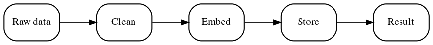

# Visuals by type — tool + template per category

For each visual category: the recommended tool(s), when to use which, and a copy-paste template you adapt per figure. All obey `visual-standards.md` (vector, shared style, no baked-in chrome). Engine: **LaTeX via Tectonic** is the documented primary for LaTeX-dependent items (`tectonic file.tex`); charts and diagrams below work without LaTeX.

## Tool availability & install (document; install when actually building figures)

| Tool | Use | Status / install |
|---|---|---|
| matplotlib (modern) | charts | run figure scripts under **uv** (pin a current matplotlib; the system one may be stale) |
| Node + Playwright + ECharts (pinned, vendored) | the **figure studio** (§7): charts + SVG schematics → Chromium print → vector PDF | `npm i playwright echarts` + a Chrome/Chromium; renders offline from `file://` |
| Graphviz `dot` | flowcharts/graphs | usually present; else `apt install graphviz` |
| Mermaid | quick flowcharts | `npx -y @mermaid-js/mermaid-cli` (no install) |
| Tectonic | LaTeX (tables/pseudocode/TikZ/PGFPlots, final PDF) | single binary — `cargo install tectonic` or download a release; auto-fetches packages |
| Poppler (`pdffonts`/`pdfimages`/`pdftocairo`) | the audit | usually present; else `apt install poppler-utils` |
| Inkscape | manual SVG/PDF polish | optional |
| Paid: Illustrator / Lucidchart / draw.io / OmniGraffle | manual polish / collaborative diagrams | only when a one-off needs hand layout; **keep the editable source** in the repo so it stays reproducible |

---

## 1. Tables → LaTeX `booktabs` + `siunitx` (generate from `pandas`)

Rules: no vertical rules; `\toprule/\midrule/\bottomrule`; numeric columns aligned on the decimal via `siunitx` `S`; consistent row spacing; bold the best value. Footnotes via `threeparttable`. **Never** ship a table as an image.

Preamble: `\usepackage{booktabs,siunitx,tabularx,threeparttable}`

```latex
\begin{table}[t]
  \centering
  \caption{Predictive performance and cost.}\label{tab:results}
  \begin{tabular}{l S[table-format=1.3] S[table-format=1.3] S[table-format=2.1]}
    \toprule
    {Method} & {Accuracy} & {F1} & {Latency (ms)} \\
    \midrule
    Baseline & 0.752 & 0.731 & 18.6 \\
    Ours     & \bfseries 0.839 & \bfseries 0.821 & 27.9 \\
    \bottomrule
  \end{tabular}
\end{table}
```

Generate the body from data (keeps numbers in sync with results):
```python
import pandas as pd
df = pd.DataFrame({"Method": ["Baseline", "Ours"], "Accuracy": [0.752, 0.839]})
print(df.to_latex(index=False, escape=False,
                  column_format="l S[table-format=1.3]"))  # paste under \toprule
```
Quick path without pandas: `tabulate(rows, headers, tablefmt="latex_booktabs")`.

---

## 2. Statistical charts → matplotlib + the shared style

Always load `pub.mplstyle` (one font/size/palette for the whole paper). Export **vector PDF**; **no title baked in** (the title is the document `\caption`). Use error bars + direct labels.

```python
import matplotlib.pyplot as plt
import numpy as np
plt.style.use(".claude/skills/research-visuals/scripts/pub.mplstyle")  # project-relative

x = np.array([1, 2, 4, 8, 16])
ours = np.array([0.67, 0.73, 0.78, 0.82, 0.84]); ours_se = np.full_like(ours, 0.012)
base = np.array([0.61, 0.66, 0.70, 0.73, 0.75]); base_se = np.full_like(base, 0.016)

fig, ax = plt.subplots()                      # size/colours come from pub.mplstyle
ax.errorbar(x, ours, yerr=ours_se, marker="o", label="Ours")
ax.errorbar(x, base, yerr=base_se, marker="s", label="Baseline")
ax.set_xscale("log", base=2); ax.set_xticks(x); ax.set_xticklabels(x)
ax.set_xlabel("Training samples (thousands)"); ax.set_ylabel("Accuracy")
ax.legend()                                   # or direct-label at line ends
fig.savefig("figures/out/accuracy.pdf")       # vector; caption is in the .tex
```
- **seaborn** is fine for statistical/heatmap plots — still `plt.style.use(pub.mplstyle)` and save PDF; use `cmap="viridis"`.
- **scienceplots** (`pip install scienceplots`, `plt.style.use(["science","ieee"])`) is an alternative pre-tuned base; layer `pub.mplstyle` after it for our palette.
- **PGFPlots/TikZ** (LaTeX) gives *perfect* font match — use for final charts when already in LaTeX and font fidelity matters most.
- **Plotly is not for print** (rasterizes WebGL traces) — interactive/web only.

---

## 3. Flowcharts / pipelines / method figures

Short node labels; left-to-right for linear pipelines; vector export; font set to the paper's. **Mermaid for drafts; Graphviz or TikZ for the final** (better font control).

**Graphviz** (available now):

Export: `dot -Tpdf pipeline.dot -o pipeline.pdf`

**Mermaid** (draft, no install): `flowchart LR\n  A[Raw] --> B[Clean] --> C[Result]` →
`npx -y @mermaid-js/mermaid-cli -i p.mmd -o p.pdf`

**TikZ** (final, font-perfect; compile with Tectonic):
```latex
\usetikzlibrary{positioning, arrows.meta}
\begin{tikzpicture}[node distance=8mm, every node/.style={draw, rounded corners, font=\small}]
  \node (a) {Raw}; \node (b) [right=of a] {Clean}; \node (c) [right=of b] {Result};
  \draw[-{Stealth}] (a) -- (b); \draw[-{Stealth}] (b) -- (c);
\end{tikzpicture}
```

---

## 4. Architecture / system / org diagrams

- **TikZ** — best font match + precise layout for a paper figure (template as above, with `shapes.geometric`).
- **Graphviz** — when auto-layout of many nodes helps (`rankdir=TB` for hierarchy/org).
- **PlantUML + C4** — software architecture at Context→Container→Component levels (`plantuml -Tpdf diagram.puml`; needs Java).
- **draw.io / Excalidraw** — manual or sketch-style; export **SVG/PDF** and keep the editable source. Use only when hand-layout is genuinely needed.

---

## 5. Pseudocode / algorithms → LaTeX `algorithm2e`

Recommended: `algorithm2e` (float + caption + label, line numbers). Alternative: `algpseudocodex`. Compile with Tectonic.

```latex
\usepackage[ruled,vlined,linesnumbered]{algorithm2e}
\begin{algorithm}[t]
\caption{Method}\label{alg:method}
\KwIn{data $X$, budget $b$}\KwOut{result $r$}
\For{each $x \in X$}{
  \If{$score(x) > \tau$}{ add $x$ to $C$\; }
}
$r \leftarrow \arg\max_{x\in C} value(x)$\;
\end{algorithm}
```
Best practice: math font for scalars ($x$), mono for identifiers, concise inline comments, always `\caption`+`\label`.

---

## 6. Code listings → `minted` (preferred) or `listings`

`minted` (syntax highlighting via Pygments; needs `--shell-escape`): 
```latex
\usepackage{minted}
\begin{listing}[t]
\inputminted[linenos, fontsize=\footnotesize, frame=lines]{python}{snippet.py}
\caption{...}\label{lst:snippet}
\end{listing}
```
No-dependency fallback: `listings` (`\usepackage{listings}` + `\lstinputlisting`). Keep lines ≤ ~85 cols for 2-column; `\footnotesize`/`\small`; line numbers on; always caption+label.

---

## 7. Figure studio — HTML/ECharts + hand-written SVG → headless Chromium → vector PDF

The second sanctioned chart pipeline (production-proven: a 14-figure submission, 100% vector, zero Type-3, papers PNG-free). One pipeline covers **both** data charts (ECharts specs) and bespoke schematics (hand-written SVG) — everything shares one `theme.css`, one vendored font, one renderer. Prefer it over matplotlib when figures need bespoke layout/annotation work (matrix-with-printed-values, annotation-heavy designs, multi-panel composites), when schematics and charts should look like one hand, or for exact-mm print sizing.

```
figures_web/
├── theme.css          # shared tokens: ink scale, grid, palette, @font-face (see below)
├── fig_*.html         # ONE spec per figure — loads theme.css + its data JSON, sets window.__READY
├── manifest.json      # [{html, out, w_mm, h_mm}] — mm-true print size per figure
├── data/*.json        # GENERATED by prep_data.py — never hand-written
├── fonts/             # the paper's body font, vendored as TTF (see rule below)
├── vendor/echarts.min.js   # pinned copy — renders offline, reproducible
├── prep_data.py       # runs/ CSVs → data/*.json; ASSERTS derived series vs published tables
└── render_figs.js     # Playwright: open file:// → wait __READY → page.pdf() at w_mm×h_mm
```

Rebuild loop: `prep_data.py` → `node render_figs.js <dir>` → copy `out/*.pdf` to the tracked figures dir → run the audit (`audit_visuals.py`).

**Rules (each earned in production):**
- **`prep_data.py` asserts provenance.** Every series derives from run/scorecard artifacts and the script *asserts* the derived values reproduce the paper's published table numbers within tolerance (e.g. `assert abs(mean - table5_value) < 0.02`). A failed assert = figure and table diverged; fix the divergence, never the assert. No number is typed by hand.
- **`window.__READY` gate.** Each `fig_*.html` sets `window.__READY = true` only after `await document.fonts.ready` *and* the chart has rendered; the renderer waits on it. Without the gate Chromium prints before the vendored font loads → silent fallback-font figures.
- **ECharts must init with `{ renderer: 'svg' }`** (and `animation: false`) so the print is vector; the canvas renderer would rasterize.
- **Vendor the paper's font as TTF, not OTF.** Chromium's print-to-PDF embeds OTF faces as Type 3 (an instant audit failure); converting the same face to TTF embeds cleanly. Ship regular/bold/italic.
- **mm-true sizing end-to-end:** `body`/`#chart` sized in mm in the HTML; `page.pdf({width: '<w_mm>mm', height: '<h_mm>mm', margin: 0, printBackground: true, pageRanges: '1'})`. The figure is *authored at* final print size — never scaled after export.
- **Doc-comment every spec:** each `fig_*.html` opens with data source, the design decisions (e.g. "y clipped to 0.7, direct value labels, gap annotation in ink"), and its mm size — the spec doubles as the figure's review description.

Renderer skeleton (`render_figs.js`, Playwright):
```js
const { chromium } = require('playwright');
const browser = await chromium.launch({ headless: true, args: ['--allow-file-access-from-files'] });
const page = await browser.newPage();
for (const m of manifest) {                       // [{html, out, w_mm, h_mm}]
  await page.goto('file:///' + dir + '/' + m.html, { waitUntil: 'load' });
  await page.waitForFunction('window.__READY === true');
  await page.pdf({ path: m.out, width: `${m.w_mm}mm`, height: `${m.h_mm}mm`,
                   margin: { top: 0, right: 0, bottom: 0, left: 0 },
                   printBackground: true, pageRanges: '1' });
}
```

`theme.css` token set (hexes per `visual-standards.md`; adapt the font):
```css
@font-face { font-family: 'PaperFont'; src: url('./fonts/PaperFont_R.ttf'); }  /* + bold, italic */
:root {
  --ink: #1a1a1a; --ink-2: #555555; --ink-3: #8a8a8a;   /* text: primary/secondary/ticks */
  --grid: #e6e6e3; --surface: #ffffff;                    /* recessive gridlines */
  --c1: #0072B2; --c2: #E69F00; --c3: #009E73; --c4: #CC79A7; --c5: #56B4E9;  /* fixed order */
  --accent: #D55E00;   /* status/highlight — deliberately OUTSIDE the categorical set */
}
```
All chart text uses the ink tokens (never a series colour); series colours come from `--c1…--c5` in fixed order; the accent is reserved for status/highlight marks so it never collides with a category.

---

## Shared colours (snippet)

```python
OKABE_ITO = {"blue":"#0072B2","vermillion":"#D55E00","green":"#009E73","purple":"#CC79A7",
             "orange":"#E69F00","sky":"#56B4E9","yellow":"#F0E442","black":"#000000"}
# sequential/continuous: use matplotlib's "viridis" or "cividis" (no extra dep).
```
(The same cycle is already the default in `pub.mplstyle`, so plain plots are colour-safe automatically.)

## Figures-as-code build (Makefile template)

Keep sources in `figures/src/`, build vector PDFs to `figures/out/`, run under uv. `make qa` runs the audit.

```makefile
PY := uv run python
SRC := figures/src
OUT := figures/out
AUDIT := .claude/skills/research-visuals/scripts/audit_visuals.py

PYS  := $(patsubst $(SRC)/%.py,$(OUT)/%.pdf,$(wildcard $(SRC)/*.py))
DOTS := $(patsubst $(SRC)/%.dot,$(OUT)/%.pdf,$(wildcard $(SRC)/*.dot))
MMDS := $(patsubst $(SRC)/%.mmd,$(OUT)/%.pdf,$(wildcard $(SRC)/*.mmd))
TEXS := $(patsubst $(SRC)/%.tex,$(OUT)/%.pdf,$(wildcard $(SRC)/*.tex))

.PHONY: figures qa clean
figures: $(PYS) $(DOTS) $(MMDS) $(TEXS)
$(OUT)/%.pdf: $(SRC)/%.py  | $(OUT); $(PY) $< --out $@
$(OUT)/%.pdf: $(SRC)/%.dot | $(OUT); dot -Tpdf $< -o $@
$(OUT)/%.pdf: $(SRC)/%.mmd | $(OUT); npx -y @mermaid-js/mermaid-cli -i $< -o $@
$(OUT)/%.pdf: $(SRC)/%.tex | $(OUT); tectonic -o $(OUT) $<
$(OUT): ; mkdir -p $(OUT)
qa: figures; $(PY) $(AUDIT) $(OUT)/*.pdf --out figures/qa_previews || true
clean: ; rm -rf $(OUT) figures/qa_previews
```
Generated PDFs under `figures/out/` are regenerable build artifacts (gitignore them; commit the `src/` sources).
