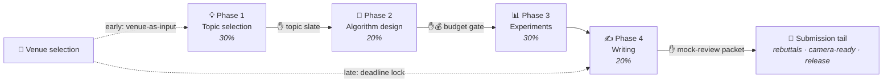

<div align="center">

# 🎓 Pretty Serious Researcher

**Turn your coding agent into a research co-author.**

A 16-skill pipeline that drives a research paper end to end — *topic → design → experiments → writing → submission* — with hard gates against hallucinated citations, fabricated numbers, and budget overruns.

[](https://github.com/fbabelle/PrettySeriousResearcher/actions/workflows/ci.yml)
[](https://github.com/fbabelle/PrettySeriousResearcher)
[](LICENSE)
[](#-the-16-skills)
[](#%EF%B8%8F-compatibility)

**Works with:** Claude Code *(verified primary)* · Codex CLI *(verified path)* · Cursor · Windsurf · GitHub Copilot · Gemini CLI · Cline · other compatible `SKILL.md`-aware agents

[Install](#-install) · [How it works](#-how-it-works) · [The gates](#%EF%B8%8F-the-gates-verify-dont-trust) · [The skills](#-the-16-skills) · [Tracking](#%EF%B8%8F-effort--cost-tracking) · [Compatibility](#%EF%B8%8F-compatibility) · [FAQ](#-faq--troubleshooting)

</div>

---

## ✨ Why

- **🧭 You stay the chooser.** At every gate the agent front-loads the diagnosis and hands you **ranked, pre-critiqued options to confirm** — never an open-ended "please review this". Reviewer panels score and draft; they never auto-accept/reject.
- **🔍 Verify, don't trust.** Every citation is resolved to a real source and content-checked. Every reported number must trace to a logged run artifact. Every figure's data is asserted against the published tables. Unverifiable = dropped, never shipped.
- **💰 Honest cost accounting.** Agent-subscription fees, metered experiment API spend, and publication fees are tracked as separate lineages; a budget gate blocks experiments until you set a cap.
- **📦 Portable by construction.** `SKILL.md` is a cross-tool standard. One installer places the set into 8 agent ecosystems; a secrets/abs-path lint runs before every copy so nothing machine-specific ever leaks into a shared install.

## 🚀 Install

Three channels — pick the one that fits. All are cross-platform (Windows / macOS / Linux) and ship the same 16 skills.

### A · Claude Code plugin (zero dependencies)

```text
/plugin marketplace add fbabelle/PrettySeriousResearcher
/plugin install research-paper-skills@pretty-serious-researcher
```

Skills become available in every project; updates arrive with `/plugin update`. *Note:* the plugin channel is great for trying the set or having it globally; for a full paper project prefer a **project install** (B or C) — the per-project ledgers, scaffold, and script paths are designed around a project-local copy.

### B · One-liner via [uv](https://docs.astral.sh/uv/) (any agent, no clone)

```bash
# Claude Code project install + tracking scaffold:
uvx --from git+https://github.com/fbabelle/PrettySeriousResearcher research-skills \
    --target claude --dest /path/to/your/project --with-scaffold

# Other agents — same command, different --target:
#   cursor · windsurf · copilot · codex · gemini · cline · agents (universal)
```

`uv` auto-provisions Python if the machine has none — this works on a fresh Windows box in PowerShell, macOS, or Linux alike.

### C · Clone + stdlib Python (no uv, no pip, no deps)

```bash
git clone https://github.com/fbabelle/PrettySeriousResearcher
cd PrettySeriousResearcher
python install_skills.py --target claude --dest /path/to/your/project --with-scaffold
```

<details>
<summary><b>Installer reference — all flags & targets</b></summary>

| Flag | Meaning |
|---|---|
| `--target` | `claude` *(verified primary)* · `cursor` · `windsurf` · `copilot` · `codex` · `gemini` · `cline` · `agents` (universal `.agents/skills/`) · `cursor-rules` (lossy → `.cursor/rules/*.mdc`) · `bundle` (neutral dir + `MANIFEST.json`) |
| `--dest` | target project root (default: cwd) |
| `--global` | install to the tool's user-global skills dir (e.g. `~/.claude/skills/`) |
| `--with-scaffold` | also write reset per-project templates/stubs (see below) |
| `--check-only` | run the secrets/absolute-path lint and exit |
| `--skills-subdir` | override the destination skills subdir if your tool version differs |
| `--force` | overwrite existing files / bypass a lint refusal |

**What `--with-scaffold` lays down** (only if absent): `docs/tracking/{state.json,cost.json}` (rate-card kept, spend/phases **reset**), an empty `docs/changelogs.md`, a `memory.md` template, `architecture.md`, a project-`README.md` stub, and `.gitignore` entries. A `CLAUDE.md` entry-point pointer is added only for the Claude target. It **never** copies run data (`effort.jsonl`, `effort.md`, `cost.md`) or machine-local config — no project's history or paths leak into another.

Every run **lints the skill set first** (absolute paths, emails, tokens, org names) and refuses to copy on a hit. For targets whose discovery path is not verified, the installer prints a "confirm your version reads this path" note, since `SKILL.md` support and locations vary by tool version.

</details>

<details>
<summary><b>After installing into Claude Code — if the skills don't show up</b></summary>

1. **Restart the session.** A **newly created** `.claude/skills/` directory is only scanned at session startup. (Skills added to an *already-existing* `.claude/skills/` load live.)
2. **Accept the workspace-trust prompt.** Project skills activate only in a trusted folder.
3. **Verify with `/skills`.** Lists every skill Claude sees; if one is missing, run `/doctor`.

How awareness works: each skill's `description` is injected into context at startup, and Claude **auto-triggers a skill when your request matches it** — "let's work on the paper" matches `research-paper`. The scaffolded `CLAUDE.md` pointer makes this proactive.

</details>

Then just say:

> *"let's start a new paper"* — or *"where are we?"* to resume.

## 🔬 How it works

The `research-paper` orchestrator is a thin state machine: it opens the session clock, reads the tracking state, routes to the current phase's craft skill, and stops at the hard gates (✋) where **you** decide.



Total budget ≈ **120 agent-active hours**, measured as *your interaction time with the agent* (framing, confirming, steering) — not human research labor, and not the agent's autonomous background runtime (tracked on a separate line). The submission tail after Phase 4 is calendar-gated by the venue, not effort-gated.

If the results are **null/negative**, the pipeline does not force a win — you get a ranked choice: reframe as an analysis/negative-result paper, retarget a venue, loop back, or stop.

## 🛡️ The gates (verify, don't trust)

| Gate | Skill | What it makes impossible to ship |
|---|---|---|
| 📚 Citations | `research-references` | A reference that cannot be resolved or does not support the claim; missing canonical/current/contradictory coverage; corrected, superseded, or retracted status ignored. |
| 🔢 Results | `research-provenance` | A number, table cell, or figure that doesn't trace to a logged `runs/` artifact. Claims ledger + executable assertions (figure data must reproduce published tables). |
| 📈 Statistics | `research-finance-rigor` | (Finance topics) A Sharpe without deflation, a backtest with leakage, an alpha that dies after costs, unlicensed/non-point-in-time data. |
| 🖼️ Figures | `research-visuals` | Type-3 fonts, raster charts, baked-in titles, colour-unsafe palettes — a two-layer audit (script + vision review) on every figure. |
| 🧑‍⚖️ Review | `research-mock-review` | Submitting blind: an adversarial multi-model panel scores the draft against the venue's rubric and pre-drafts rebuttals. **Never auto-decides.** |
| 💰 Budget | `research-tracking` | Entering experiments without a finalized spend cap; conflating subscription cost with metered API spend. |

## 🧰 The 16 skills

| Skill | Role |
|---|---|
| `research-paper` | 🎛️ **Entry point.** Thin orchestrator: session clock, routing, gates, status. |
| `research-topic-selection` | Phase 1 — two-direction interview, multi-angle novelty scan, scored topic slate, paper skeleton. |
| `research-algo-design` | Phase 2 — candidate evaluation, solvability gate, implementation with tests, ablation seeds. |
| `research-experiments` | Phase 3 — smoke tests, ablation matrix, throttled + resumable runs, usage logging. |
| `research-writing` | Phase 4 — drafts (md + LaTeX + PDF), venue-targeted short version, submission builds. |
| `research-submission` | 📮 Post-packet tail — portal execution, evidence-mapped rebuttals, camera-ready, release. |
| `research-tracking` | ⏱️ Effort & cost ledgers, two time clocks, budget playbook (`track.py`). |
| `research-references` | 📚 Anti-hallucination citation gate + running evidence ledger. |
| `research-provenance` | 🔢 Results-integrity gate: every number resolves to a run artifact. |
| `research-finance-rigor` | 📈 Statistical honesty + data-licensing gate for finance-facing work. |
| `research-visuals` | 🖼️ Publication-quality tables/charts/diagrams — two sanctioned pipelines + audit. |
| `research-venue-selection` | 🎯 Venue as an early input, then a deadline-feasible lock; fees → cost tracking. |
| `research-mock-review` | 🧑‍⚖️ Pre-submission reviewer panel via coding-agent CLIs; ranked weaknesses + rebuttals. |
| `research-reflection` | 🪞 Periodic adversarial self-check with an anti-tilt principle (no change-for-its-own-sake). |
| `research-code-review` | ✅ 4-step design judgment + test discipline after any research code. |
| `research-repo-hygiene` | 📁 Standing conventions: layout, changelog, draft rotation, commit rules. |

## ⏱️ Effort & cost tracking

```bash
python .claude/skills/research-tracking/scripts/track.py          # refresh + report line
python .claude/skills/research-tracking/scripts/track.py --json   # machine summary
```

Derives **agent-active hours** and **token usage** from compatible Claude Code JSONL (idle gaps >1h excluded); other hosts need an adapter or manual effort rows. It prices experiment API spend from `runs/usage.jsonl` × a dated rate-card and buckets measured effort by phase:

```text
Spent $12.40 of $150.00 (8%) | exp-llm $9.10 / compute $2.00 / data $1.30 |
coding $200.00 (1mo) + pub $0.00 (outside cap) | effort: 18.2 active-hrs, 41,203,118 tokens
```

Cost keeps lineages apart: coding-agent billing is detected per plan (flat plans plus explicit metered actuals) and reported outside the experiment cap; the cap governs method-running LLM API, compute, and data spend only. Transcript tokens never determine billing. Schema details: `.claude/skills/research-tracking/references/ledger-formats.md`.

## 🖥️ Compatibility

|  | Linux | macOS | Windows |
|---|:---:|:---:|:---:|
| Skills (all agents) | ✅ | ✅ | ✅ |
| Installer (`uvx` / stdlib Python 3.10+) | ✅ | ✅ | ✅ |
| `track.py` transcript discovery | ✅ | ✅ | ✅ |
| CI (tests + lint + install smokes) | ✅ | ✅ | ✅ |

| Agent | Target | Skills location |
|---|---|---|
| **Claude Code** | `claude` *(verified primary; also the plugin channel)* | `.claude/skills/` |
| Cursor | `cursor` (or `cursor-rules`, lossy) | `.cursor/skills/` |
| Windsurf | `windsurf` | `.windsurf/skills/` |
| GitHub Copilot | `copilot` | `.github/skills/` |
| Codex CLI | `codex` *(verified path)* | `.agents/skills/` |
| Gemini CLI | `gemini` | `.gemini/skills/` |
| Cline | `cline` | `.cline/skills/` |
| Anything else | `agents` (universal) or `bundle` (neutral + manifest) | `.agents/skills/` |

`SKILL.md` is a de-facto cross-tool standard, but support varies by tool version — the installer prints the path it used so you can confirm your tool reads it (override with `--skills-subdir`).

## 📁 What a paper project looks like

```text
your-paper/
├── .claude/skills/          # the 16 skills (installed, read-only — fix upstream, reinstall)
├── docs/
│   ├── plans/               # timestamped plan backups
│   ├── changelogs.md        # append-only change log
│   ├── tracking/            # effort/cost ledgers + state
│   ├── claims-ledger.md     # claim → evidence rows (Phase 3+)
│   ├── venues.md            # deadline-feasible venue plan
│   ├── review/              # pre-submission mock-review packets
│   └── submission/          # staged portal forms + response drafts
├── drafts/                  # versioned paper drafts (vNN-title.md + .pdf)
├── src/ · experiments/ · runs/ · figures/ · tests/   # created as phases reach them
├── architecture.md          # design + project charter
└── memory.md                # untracked user patterns
```

## 🔒 Portability & privacy

The skills are authored generically — no hardcoded project paths, no emails/tokens/identifying data. `track.py` locates transcripts portably (`$CLAUDE_CONFIG_DIR`, then `~/.claude`, then sibling homes) and encodes project paths the way the harness does on all three OSes. **Every install lints first** and refuses to copy on a hit:

```bash
python install_skills.py --check-only     # or: uvx --from . research-skills --check-only
```

## ❓ FAQ / troubleshooting

<details>
<summary><b>Can I adopt this mid-research?</b></summary>

Yes — install without `--with-scaffold` so your existing `docs/`, drafts, and ledgers are untouched:

```bash
uvx --from git+https://github.com/fbabelle/PrettySeriousResearcher research-skills \
    --target claude --dest /path/to/in-flight-project
```

On the next engagement the orchestrator detects no tracking state, bootstraps `docs/tracking/`, and picks up from your current phase.

</details>

<details>
<summary><b>Which README is which?</b></summary>

- **This README** documents the *skill set* (install, lifecycle, gates).
- **Your paper project keeps its own README** — a per-project quickstart for *that paper's* code, experiments, and figures. The skill set maintains it for you (`research-repo-hygiene` defines it, `research-writing` keeps it current, `--with-scaffold` writes the stub). Don't replace it with this one.

</details>

<details>
<summary><b>Why is the plugin channel not recommended for full paper projects?</b></summary>

A plugin install loads the skills from Claude Code's plugin cache — great for global availability, but the workflow assumes project-local artifacts (per-project ledgers in `docs/tracking/`, `track.py` invoked by its project path, per-paper scaffold). The project install keeps everything self-contained and reproducible per paper.

</details>

<details>
<summary><b>Skills are installed but the agent edited them — is that OK?</b></summary>

No — installed skills are **read-only by convention**. The set is authored and maintained in this source repo; a paper project that edits its installed copy diverges and gets clobbered on the next reinstall. Fix upstream here, then reinstall (`research-repo-hygiene` encodes this rule).

</details>

## 🤝 Contributing

Improvements flow **upstream-first**: fix or extend a skill *here*, run the checks, then reinstall into your paper projects.

```bash
uv sync                                      # dev env (Python 3.12 via uv)
uv run pytest -q                             # unit tests
uv run python install_skills.py --check-only # secrets/abs-path lint
```

CI runs the same suite plus copy-mode and wheel-mode install smokes on Linux, macOS, and Windows. Describe the what and why of a change in the PR description.

## 📄 License

[Apache-2.0](LICENSE)
